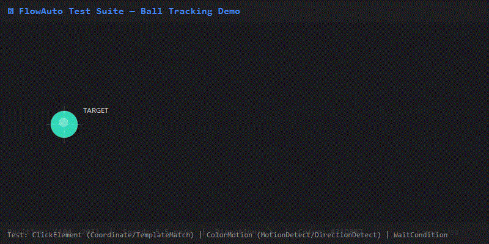
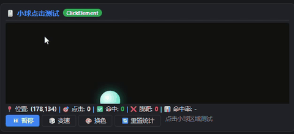
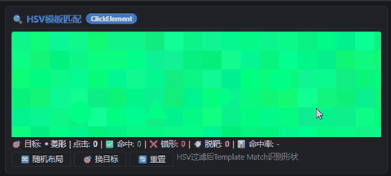
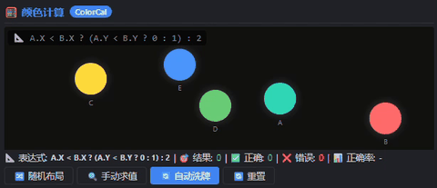
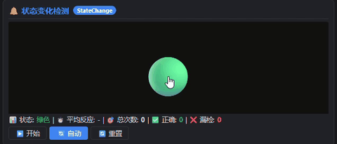

# 馃И FlowAuto 娴嬭瘯濂椾欢 鈥斺€?娴嬭瘯鏂规硶涓庢枃妗?

> **鐗堟湰**: 2.1  
> **鏃ユ湡**: 2026-06-21  
> **閫傜敤椤圭洰**: FlowAuto v5.0 (Visual Workflow Automation Engine)  
> **娴嬭瘯椤甸潰**: `TestScripts/FlowAuto_TestSuite_v2.html` (v2 缁撴灉楠岃瘉鐗?  
> **鏃х増椤甸潰**: `TestScripts/FlowAuto_TestSuite.html` (v1 鍩虹鐗?

---

## 馃啎 v2.0 鏇存柊鍐呭

| 鏇存柊椤?| 璇存槑 |
|---|---|
| 缁撴灉楠岃瘉鏃ュ織 | 姣忎釜闈㈡澘涓嬫柟鏄剧ず瀹炴椂缁熻鏁版嵁锛堝懡涓巼/姝ｇ‘鐜?鍙嶅簲鏃堕棿锛?|
| ClickElement 楠岃瘉 | 榧犳爣鐐瑰嚮灏忕悆鑷姩缁熻鍛戒腑/鑴遍澏锛屾樉绀哄懡涓巼 |
| HSV ColorMotion | 鏉備贡鍣０鑳屾櫙 + 鐙壒鑹插僵灏忕悆 (#00ff88)锛屾敮鎸佺偣鍑诲懡涓粺璁′笌閫熷害闅忔満鍖?|
| ColorCal 楠岃瘉 | 澶嶆潅涓夊厓琛ㄨ揪寮忥紙0/1/2涓夌粨鏋滐級锛屾敮鎸侀敭鐩樻暟瀛楅敭 `0`/`1`/`2` 浣滅瓟骞剁粺璁℃纭巼 |
| StateChange 楠岃瘉 | 闅忔満寤惰繜鍚庨鑹插彉鍖栵紝鐩戞祴鐢ㄦ埛鐐瑰嚮鍙嶅簲鏃堕棿锛岃秴鏃舵湭鐐瑰嚮璁颁负婕忔 |
| Bar HSV | 缁嗘潌姘村钩杩愬姩妫€娴嬶紝AD閿洏楠岃瘉宸﹀彸鏂瑰悜璇嗗埆姝ｇ‘鐜?|
| `.flow.json` 娴嬭瘯鏂囦欢 | 5涓?FlowAuto 鍙洿鎺ュ姞杞界殑鍔熻兘娴嬭瘯娴佺▼ |
| GifGen 宸ュ叿 | 鍐呯疆 GIF 鐢熸垚鍣?(`TestScripts/GifGen/`) |
| 鑷姩缁煎悎娴嬭瘯 | 涓€閿繍琛屾墍鏈夋祴璇曞苟姹囨€绘姤鍛?|

---

## 馃摉 鐩綍

1. [姒傝堪](#姒傝堪)
2. [娴嬭瘯椤甸潰鍚姩鏂规硶](#娴嬭瘯椤甸潰鍚姩鏂规硶)
3. [娴嬭瘯鍦烘櫙璇﹁В](#娴嬭瘯鍦烘櫙璇﹁В)
   - [鍦烘櫙1: 灏忕悆杩借釜 鈥?ClickElement / ColorMotion](#鍦烘櫙1-灏忕悆杩借釜--clickelement--colormotion)
   - [鍦烘櫙2: HSV 杩愬姩妫€娴?鈥?ColorMotion](#鍦烘櫙2-hsv-杩愬姩妫€娴?-colormotion)
   - [鍦烘櫙3: 缁嗘潌鏂瑰悜妫€娴?鈥?ColorMotion DirectionDetect](#鍦烘櫙3-缁嗘潌鏂瑰悜妫€娴?-colormotion-directiondetect)
   - [鍦烘櫙4: 棰滆壊璁＄畻 鈥?ColorCal](#鍦烘櫙4-棰滆壊璁＄畻--colorcal)
   - [鍦烘櫙5: 鐘舵€佸彉鍖?鈥?ColorMotion StateChange](#鍦烘櫙5-鐘舵€佸彉鍖?-colormotion-statechange)
4. [闅忔満鎬ц璁＄瓥鐣(#闅忔満鎬ц璁＄瓥鐣?
5. [FlowAuto 娴佺▼閰嶇疆绀轰緥](#flowauto-娴佺▼閰嶇疆绀轰緥)
6. [褰曞埗 GIF 鏂规硶](#褰曞埗-gif-鏂规硶)
7. [瀹屾暣娴嬭瘯娓呭崟](#瀹屾暣娴嬭瘯娓呭崟)
8. [鏁呴殰鎺掓煡](#鏁呴殰鎺掓煡)

---

## 姒傝堪

`FlowAuto_TestSuite_v2.html` 鏄竴涓嚜鍖呭惈鐨勬祻瑙堝櫒娴嬭瘯椤甸潰锛岀敤浜庡叏闈㈤獙璇?FlowAuto 鑷姩鍖栧紩鎿庣殑鏍稿績鍔熻兘銆傞〉闈㈡ā鎷熶簡澶氱鐪熷疄妗岄潰鑷姩鍖栧満鏅紝鍖呭惈**闅忔満鎬у厓绱?*浠ユ祴璇?FlowAuto 鍦ㄤ笉纭畾鏉′欢涓嬬殑椴佹鎬с€?

### 婕旂ず GIF

浠ヤ笅鏄娇鐢?GifGen 宸ュ叿鐢熸垚鐨勮嚜鍔ㄥ寲婕旂ず GIF锛屽睍绀轰簡灏忕悆杩借釜娴嬭瘯鍦烘櫙鐨勬牳蹇冩蹇碉細



> 馃挕 杩欎釜 GIF 婕旂ず浜嗗皬鐞冨湪鍖哄煙鍐呬笉瑙勫垯杩愬姩銆侀鑹查殢鏈哄垏鎹€佺澹佸弽寮圭瓑琛屼负鈥斺€旇繖姝ｆ槸 FlowAuto 鐨?`ClickElement`锛堝姩鎬佸潗鏍囩偣鍑伙級鍜?`ColorMotion`锛堣繍鍔ㄦ娴嬶級鑺傜偣闇€瑕佸鐞嗙殑鍏稿瀷鍦烘櫙銆?

### 鍚勬祴璇曟祦绋嬪疄鏈烘紨绀?

浠ヤ笅 GIF 涓?FlowAuto 瀹為檯杩愯 `.flow.json` 娴嬭瘯娴佺▼鐨勫睆骞曞綍鍒讹細

| 娴嬭瘯娴佺▼ | 婕旂ず GIF | 璇存槑 |
|---|---|---|
| ClickElement 灏忕悆鐐瑰嚮 |  | 鍔ㄦ€佸潗鏍囩偣鍑昏繍鍔ㄥ皬鐞冿紝缁熻鍛戒腑鐜?|
| ClickElement HSV + TemplateMatch |  | HSV 杩囨护 + 澶氬昂搴︽ā鏉垮尮閰嶈瘑鍒舰鐘?|
| ClickElement MatchHSV 娣峰悎 |  | HSV 杩囨护鍚庣洿鎺ョ偣鍑绘渶澶ч鑹插尯鍩?|
| ColorMotion 鏂瑰悜妫€娴?|  | 鑹插潡杩借釜璇嗗埆宸﹀彸鏂瑰悜锛岃Е鍙?A/D 鎸夐敭 |
| ColorCal 棰滆壊璁＄畻 |  | 澶氱洰鏍囧潗鏍囪瘑鍒?+ 宓屽涓夌洰琛ㄨ揪寮忔眰鍊?|
| StateChange 鐘舵€佸彉鍖?|  | 棰滆壊鍙樺寲妫€娴?+ 鍙嶅簲鏃堕棿缁熻 |

### 娴嬭瘯瑕嗙洊鑼冨洿

| FlowAuto 鑺傜偣绫诲瀷 | 瀵瑰簲娴嬭瘯闈㈡澘 | 娴嬭瘯閲嶇偣 |
|---|---|---|
| `ClickElement` (Coordinate) | 馃弨 灏忕悆杩借釜 | 鍔ㄦ€佸潗鏍囪绠椼€佸懡涓粺璁?|
| `ClickElement` (Coordinate) | 馃幆 HSV 灏忕悆 | 鍣０鑳屾櫙涓姩鎬佺洰鏍囩偣鍑?|
| `ColorMotion` (MotionDetect) | 馃弨 灏忕悆杩借釜 / 馃幆 HSV 灏忕悆 | 棰滆壊杩愬姩妫€娴?|
| `ColorMotion` (DirectionDetect) | 馃搹 缁嗘潌杩愬姩 | 姘村钩宸﹀彸鏂瑰悜璇嗗埆 |
| `ColorMotion` (StateChange) | 馃敂 鐘舵€佸彉鍖?| 棰滆壊鍙樺寲鍙嶅簲鏃堕棿妫€娴?|
| `ColorCal` | 馃М 棰滆壊璁＄畻 | 澶氱洰鏍囧潗鏍囪绠椾笌涓夊厓琛ㄨ揪寮忔眰鍊?|
| `WaitCondition` (Timeout) | 馃弨 灏忕悆杩借釜 | 瓒呮椂绛夊緟 |

---

## 娴嬭瘯椤甸潰鍚姩鏂规硶

### 鏂规硶涓€锛氱洿鎺ョ敤娴忚鍣ㄦ墦寮€

```
鍙屽嚮 TestScripts/FlowAuto_TestSuite_v2.html
```

> 鉁?鏃犻渶浠讳綍鏈嶅姟鍣紝绾潤鎬?HTML锛屽彲鐩存帴鍦ㄦ祻瑙堝櫒涓墦寮€銆?

### 鏂规硶浜岋細鍛戒护琛屽惎鍔紙鎺ㄨ崘锛屽彲鍥哄畾绐楀彛鏍囬锛?

```powershell
# 浣跨敤 Edge
start msedge "file:///d:/AutoScript/FlowAuto/TestScripts/FlowAuto_TestSuite_v2.html"

# 浣跨敤 Chrome
start chrome "file:///d:/AutoScript/FlowAuto/TestScripts/FlowAuto_TestSuite_v2.html"
```

### 鏂规硶涓夛細閫氳繃 FlowAuto StartProgram 鑺傜偣鍚姩

鍦?FlowAuto 涓厤缃?`StartProgram` 鑺傜偣锛?
- **FilePath**: `C:\Program Files (x86)\Microsoft\Edge\Application\msedge.exe`
- **Arguments**: `file:///d:/AutoScript/FlowAuto/TestScripts/FlowAuto_TestSuite_v2.html`
- **WindowTitleKeyword**: `FlowAuto Test Suite`

### 绐楀彛璇嗗埆淇℃伅

| 灞炴€?| 鍊?|
|---|---|
| 绐楀彛鏍囬 | `FlowAuto 娴嬭瘯濂椾欢 | FlowAuto Test Suite` |
| 绐楀彛绫诲悕 | `Chrome_WidgetWin_1` (Edge) / `MozillaWindowClass` (Firefox) |
| 鎺ㄨ崘娴忚鍣?| **Microsoft Edge** (Chromium) |

---

## 娴嬭瘯鍦烘櫙璇﹁В

### 鍦烘櫙1: 灏忕悆杩借釜 鈥?ClickElement / ColorMotion

**闈㈡澘浣嶇疆**: 宸︿笂瑙?鈥?馃弨 灏忕悆杩借釜

**娴嬭瘯鐩爣**: 楠岃瘉 FlowAuto 鑳藉惁鍑嗙‘瀹氫綅骞剁偣鍑诲湪绐楀彛涓殢鏈虹Щ鍔ㄧ殑瑙嗚鐩爣锛屽苟缁熻鍛戒腑/鑴遍澏銆?

**灏忕悆琛屼负鐗瑰緛**锛堥殢鏈烘€ц璁★級:
- 鍒濆閫熷害闅忔満鍖栵紙VX, VY 鈭?[-3, 3]锛?
- 闅忔満寰壈鍔紙姣忓抚 卤0.15 闅忔満鍔犻€熷害锛?
- 纰板鍙嶅脊甯﹂殢鏈鸿兘閲忥紙鍙嶅脊绯绘暟 0.7~1.3 闅忔満锛?
- 棰滆壊闅忔満鍒囨崲锛?绉嶉璁鹃鑹诧級
- 澶у皬闅忔満鍙樺寲锛?0px~80px锛?


**娴嬭瘯姝ラ**:

| 姝ラ | 鎿嶄綔 | 棰勬湡缁撴灉 | FlowAuto 鑺傜偣 |
|---|---|---|---|
| 1 | 鐐瑰嚮"馃幉 鍙橀€? | 灏忕悆浠ラ殢鏈洪€熷害绉诲姩 | 鈥?|
| 2 | 鍦?FlowAuto 涓惎鍔?ClickElement(Coordinate) 娴佺▼ | 榧犳爣绉诲姩鍒板皬鐞冧綅缃苟鐐瑰嚮 | `ClickElement` |
| 3 | 鐐瑰嚮"馃帹 鎹㈣壊" | 灏忕悆棰滆壊鏀瑰彉 | 鈥?|
| 4 | 浣跨敤 ColorMotion(MotionDetect) 妫€娴嬪皬鐞冩槸鍚﹀湪绉诲姩 | 姝ｇ‘鍒ゆ柇杩愬姩/闈欐鐘舵€?| `ColorMotion` |
| 5 | 鐐瑰嚮"鈴笍 鏆傚仠" | 灏忕悆鍋滄 | 鈥?|
| 6 | ColorMotion 搴旀娴嬪埌 "Stationary" | 闈欐鍒ゆ柇姝ｇ‘ | `ColorMotion` |
| 7 | 楠岃瘉 WaitCondition(Timeout) 鍦ㄦ殏鍋滄湡闂磋秴鏃?| 瓒呮椂寮傚父瑙﹀彂 | `WaitCondition` |

**FlowAuto 閰嶇疆瑕佺偣**:
```
ClickElement 鑺傜偣:
  LocateMode: Coordinate
  Region: 闇€瑕佹牴鎹祻瑙堝櫒绐楀彛璁＄畻灏忕悆鎵€鍦ㄥ尯鍩?
  浣跨敤 UseFullScreen: false
  閰嶇疆 Region 涓哄皬鐞冩墍鍦ㄩ潰鏉跨殑绐楀彛鍖哄煙

ColorMotion 鑺傜偣:
  Mode: MotionDetect
  浣跨敤 HSV 棰滆壊杩囨护 (灏忕悆榛樿鑹?#31d8b7)
  璁剧疆鍚堥€傜殑妫€娴嬪尯鍩?
```

---

### 鍦烘櫙2: HSV 杩愬姩妫€娴?鈥?ColorMotion

**闈㈡澘浣嶇疆**: 涓笂 鈥?馃幆 HSV棰滆壊杩愬姩妫€娴?

**娴嬭瘯鐩爣**: 鍦ㄦ潅涔卞櫔澹拌儗鏅笅璇嗗埆骞剁偣鍑荤壒瀹氶鑹诧紙#00ff88锛夌殑杩愬姩灏忕悆锛岀粺璁＄偣鍑诲懡涓巼銆?

**闅忔満鎬ц璁?*:
- 鑳屾櫙鍖呭惈 80 涓殢鏈洪鑹?澶у皬鍣０鐐?+ 20 涓殢鏈烘棆杞煩褰?
- 灏忕悆閫熷害闅忔満鎵板姩锛堟瘡甯?卤0.3 闅忔満鍔犻€熷害锛?
- 纰板鍙嶅脊甯﹂殢鏈鸿兘閲忥紙鍙嶅脊绯绘暟 0.7~1.2 闅忔満锛?
- 鏀寔鎵嬪姩鍙橀€燂紙闅忔満 VX/VY锛?

![HSV 杩愬姩妫€娴嬪疄鏈烘紨绀篯(gifs/test_click_hsv.flow_template_match.gif)

**娴嬭瘯姝ラ**:

| 姝ラ | 鎿嶄綔 | 棰勬湡缁撴灉 | FlowAuto 鑺傜偣 |
|---|---|---|---|
| 1 | 瑙傚療灏忕悆鍦ㄥ櫔澹拌儗鏅腑杩愬姩 | 灏忕悆淇濇寔 #00ff88 鐙壒鑹插僵 | 鈥?|
| 2 | 鐐瑰嚮"鈿?鍙橀€? | 灏忕悆閫熷害闅忔満鍖?| 鈥?|
| 3 | 浣跨敤 ColorMotion 妫€娴嬪皬鐞冭繍鍔ㄦ柟鍚?| 姝ｇ‘璇嗗埆杩愬姩鐘舵€?| `ColorMotion` |
| 4 | 榧犳爣鐐瑰嚮灏忕悆鍖哄煙 | 鑻ュ懡涓垯缁熻 +1锛岃劚闈朵篃璁板綍 | `ClickElement` |
| 5 | 鏌ョ湅涓嬫柟缁熻鏍?| 鎬荤偣鍑汇€佸懡涓€佽劚闈躲€佸懡涓巼瀹炴椂鏇存柊 | 鈥?|
| 6 | 鐐瑰嚮"馃幉 閲嶇粯鍣０" | 鑳屾櫙鍣０閲嶆柊闅忔満鐢熸垚 | 鈥?|
| 7 | 楠岃瘉 ColorMotion 鍦ㄥ櫔澹板彉鍖栧悗浠嶈兘杩借釜 | 灏忕悆妫€娴嬩笉鍙楀櫔澹板奖鍝?| `ColorMotion` |

**FlowAuto 閰嶇疆瑕佺偣**:
```
ClickElement 鑺傜偣:
  LocateMode: Coordinate / TemplateMatch
  浣跨敤 HSV 杩囨护瀹氫綅 #00ff88 灏忕悆
  娉ㄦ剰鍣０鑳屾櫙鍙兘骞叉壈妯℃澘鍖归厤锛屾帹鑽?Coordinate + ColorCal 杈呭姪

ColorMotion 鑺傜偣:
  Mode: MotionDetect
  TargetHSV: 閽堝 #00ff88 璁剧疆 HSV 鑼冨洿
  NoiseFilter: 鍚敤闈㈢Н/褰㈢姸杩囨护浠ユ帓闄ゅ櫔澹扮偣
```

---

### 鍦烘櫙3: 缁嗘潌鏂瑰悜妫€娴?鈥?ColorMotion DirectionDetect

**闈㈡澘浣嶇疆**: 鍙充笅 鈥?馃搹 HSV缁嗘潌杩愬姩妫€娴?

**娴嬭瘯鐩爣**: 楠岃瘉 ColorMotion DirectionDetect 妯″紡鐨勬按骞虫柟鍚戯紙宸?鍙?闈欐锛夋娴嬭兘鍔涖€?

**闅忔満鎬ц璁?*:
- 缁嗘潌姘村钩杩愬姩锛岄€熷害闅忔満鎵板姩锛堟瘡甯?卤0.3 闅忔満鍔犻€熷害锛?
- 纰板鍙嶅脊甯﹂殢鏈鸿兘閲忥紙鍙嶅脊绯绘暟 0.7~1.2 闅忔満锛?
- 鏀寔鎵嬪姩鍙橀€?
- 鑳屾櫙鍚屾牱鍖呭惈鍣０骞叉壈

![ColorMotion 鏂瑰悜妫€娴嬪疄鏈烘紨绀篯(gifs/test_colormotion_hsv.flow.gif)

**娴嬭瘯姝ラ**:

| 姝ラ | 鎿嶄綔 | 棰勬湡缁撴灉 | FlowAuto 鑺傜偣 |
|---|---|---|---|
| 1 | 瑙傚療缁嗘潌鍦ㄥ尯鍩熷唴宸﹀彸杩愬姩 | 鈥?| 鈥?|
| 2 | 閰嶇疆 ColorMotion(DirectionDetect) | 妫€娴嬪埌褰撳墠姘村钩鏂瑰悜 | `ColorMotion` |
| 3 | 鏂瑰悜涓?"Right" 鏃?鈫?瑙﹀彂 Right 杈撳嚭绔彛 | Right 鍒嗘敮琚墽琛?| `ColorMotion` |
| 4 | 鏂瑰悜涓?"Left" 鏃?鈫?瑙﹀彂 Left 杈撳嚭绔彛 | Left 鍒嗘敮琚墽琛?| `ColorMotion` |
| 5 | 鎸夐敭鐩?`A` / `D` 妯℃嫙 FlowAuto 鍝嶅簲 | 楠岃瘉鏂瑰悜鍒ゆ柇姝ｇ‘鐜囩粺璁?| 鈥?|
| 6 | 鐐瑰嚮"鈴笍 鏆傚仠" | 缁嗘潌鍋滄锛屽簲妫€娴嬪埌 Stationary | `ColorMotion` |

**FlowAuto 閰嶇疆瑕佺偣**:
```
ColorMotion 鑺傜偣:
  Mode: DirectionDetect
  DirectionType: Horizontal (浠呮娴?Left/Right/Stationary)
  WindowMs: 150 (浣嶇Щ鏃堕棿绐楀彛)
  TargetHSV: 閽堝 #00ff88 缁嗘潌璁剧疆
```

> 馃挕 鏈満鏅粎妫€娴嬫按骞虫柟鍚戙€傞敭鐩?`A` = 宸︼紝`D` = 鍙筹紝鐢ㄤ簬浜哄伐楠岃瘉鏂瑰悜璇嗗埆鍑嗙‘鐜囥€?

---

### 鍦烘櫙4: 棰滆壊璁＄畻 鈥?ColorCal

**闈㈡澘浣嶇疆**: 宸︿笅 鈥?馃М 棰滆壊璁＄畻

**娴嬭瘯鐩爣**: 楠岃瘉 ColorCal 澶氱洰鏍囬鑹茶瘑鍒€佸潗鏍囪绠楀拰澶嶆潅涓夊厓琛ㄨ揪寮忔眰鍊煎姛鑳姐€傜敤鎴烽€氳繃閿洏 `0`/`1`/`2` 浣滅瓟锛岀郴缁熻嚜鍔ㄧ粺璁℃纭巼銆?

**闅忔満鎬ц璁?*:
- 5涓鑹茬偣锛圓~E锛夛紝姣忎釜鏈変笉鍚岀殑鍥哄畾棰滆壊
- "闅忔満娲楃墝"锛氭墦涔辨墍鏈夌偣鍦ㄥ尯鍩熷唴鐨勪綅缃?
- 琛ㄨ揪寮忎负涓夌粨鏋滐紙0/1/2锛夌殑宓屽涓夊厓琛ㄨ揪寮?
- 鑷姩妯″紡涓嬫瘡娆′綔绛斿悗鑷姩娲楃墝杩涘叆涓嬩竴杞?


**娴嬭瘯姝ラ**:

| 姝ラ | 鎿嶄綔 | 棰勬湡缁撴灉 | FlowAuto 鑺傜偣 |
|---|---|---|---|
| 1 | 瑙傚療褰撳墠琛ㄨ揪寮忓拰 5 涓鑹茬偣浣嶇疆 | 鈥?| 鈥?|
| 2 | 鍦?FlowAuto 涓厤缃?ColorCal 妫€娴?5 涓洰鏍?| 璇嗗埆鍒?5 涓洰鏍囧強鍏跺潗鏍?| `ColorCal` |
| 3 | 鏍规嵁琛ㄨ揪寮忛€昏緫鍒ゆ柇缁撴灉搴斾负 0銆? 鎴?2 | 浜哄伐/鑷姩璁＄畻 | 鈥?|
| 4 | 鎸変笅閿洏椤惰鏁板瓧閿?`0`/`1`/`2` | 绯荤粺鍒ゆ柇瀵归敊骞舵洿鏂扮粺璁?| 鈥?|
| 5 | 鏌ョ湅涓嬫柟缁熻鏍?| 姝ｇ‘銆侀敊璇€佹纭巼瀹炴椂鏇存柊 | 鈥?|
| 6 | 鐐瑰嚮"馃攢 闅忔満甯冨眬" | 浣嶇疆鎵撲贡锛岃〃杈惧紡閲嶆柊姹傚€?| 鈥?|
| 7 | 楠岃瘉 ColorCal 鍦ㄦ柊甯冨眬涓嬪潗鏍囪瘑鍒纭?| 琛ㄨ揪寮忕粨鏋滀笌瀹為檯涓€鑷?| `ColorCal` |

**绀轰緥 ColorCal 琛ㄨ揪寮?*锛堜笁缁撴灉 0/1/2锛?

```csharp
// 绀轰緥1: A鍦˙宸︿笂鈫?, 宸︿笅鈫?, 鍙宠竟鈫?
A.X < B.X ? (A.Y < B.Y ? 0 : 1) : 2

// 绀轰緥2: AC姘村钩璺濈<30鈫?, A鍦ㄥ乏鈫?, 鍙斥啋2
Math.Abs(A.X - C.X) < 30 ? 0 : (A.X < C.X ? 1 : 2)

// 绀轰緥3: AB涓偣鍦–宸︿笖C鍦ㄤ笂鈫?, 涓偣宸︿笖C鍦ㄤ笅鈫?, 涓偣鍙斥啋2
(A.X + B.X)/2 < C.X ? (C.Y < 100 ? 0 : 1) : 2

// 绀轰緥4: D鍦‥鍙充笅鈫?, 鍙充笂鈫?, 宸﹁竟鈫?
D.Found ? (D.X > E.X ? (D.Y > E.Y ? 0 : 1) : 2) : 0
```

**FlowAuto 閰嶇疆瑕佺偣**:
```
ColorCal 鑺傜偣:
  Targets: A~E 浜斾釜棰滆壊鐩爣
  Expression: 涓夌粨鏋滆〃杈惧紡锛屾牴鎹笟鍔￠€昏緫杩斿洖 0/1/2
  ResultBranches: 鏍规嵁杩斿洖鍊煎垎娴佸埌涓嶅悓鍒嗘敮
```

> 馃挕 閿洏蹇嵎閿細`0`/`1`/`2` 鐩存帴浣滅瓟锛堟棤闇€鑱氱劍锛屽叏灞€鍝嶅簲锛夈€傝嚜鍔ㄦā寮忎笅绛斿鍚庤嚜鍔ㄨ繘鍏ヤ笅涓€杞€?

---

### 鍦烘櫙5: 鐘舵€佸彉鍖?鈥?ColorMotion StateChange

**闈㈡澘浣嶇疆**: 涓笅 鈥?馃敂 鐘舵€佸彉鍖栨娴?

**娴嬭瘯鐩爣**: 楠岃瘉 FlowAuto 瀵归鑹茬姸鎬佸彉鍖栫殑妫€娴嬭兘鍔涳紝浠ュ強鍙嶅簲鏃堕棿缁熻銆傜姸鎬佹寚绀哄櫒浠庣豢鑹查殢鏈哄欢杩熷悗鍙樹负鍏朵粬棰滆壊锛岀敤鎴风偣鍑诲悗璁板綍鍙嶅簲鏃堕棿骞舵仮澶嶇豢鑹层€?

**闅忔満鎬ц璁?*:
- 鍒濆鐘舵€佷负缁胯壊锛堭煙級
- 闅忔満寤惰繜 1.5~5.5 绉掑悗鍙樹负闈炵豢鑹茬姸鎬侊紙绾?榛?钃?绱殢鏈猴級
- 瓒呮椂鏃堕棿 3 绉掞細鑻ョ敤鎴锋湭鐐瑰嚮鍒欒涓烘紡妫€锛岃嚜鍔ㄦ仮澶嶇豢鑹?
- 鐐瑰嚮鍚庨殢鏈哄欢杩?0.8~2.3 绉掑紑濮嬩笅涓€杞?

![StateChange 鐘舵€佸彉鍖栧疄鏈烘紨绀篯(gifs/test_statechange.flow.gif)

**娴嬭瘯姝ラ**:

| 姝ラ | 鎿嶄綔 | 棰勬湡缁撴灉 | FlowAuto 鑺傜偣 |
|---|---|---|---|
| 1 | 瑙傚療鐘舵€佹寚绀哄櫒鍒濆涓虹豢鑹?| 鈥?| 鈥?|
| 2 | 绛夊緟闅忔満鏃堕棿鍚庨鑹插彉鍖?| 鍙樹负绾?榛?钃?绱箣涓€锛岃鏃跺櫒寮€濮?| 鈥?|
| 3 | 绔嬪嵆鐐瑰嚮鐘舵€佸尯鍩?| 璁板綍鍙嶅簲鏃堕棿锛坢s锛夛紝鐘舵€佹仮澶嶇豢鑹?| `ClickElement` |
| 4 | 鏌ョ湅涓嬫柟缁熻鏍?| 鎬绘鏁般€佹纭鏁般€佹紡妫€娆℃暟銆佸钩鍧囧弽搴旀椂闂?| 鈥?|
| 5 | 涓嶇偣鍑荤瓑寰?3 绉?| 瓒呮椂璁颁负婕忔锛岃嚜鍔ㄦ仮澶嶇豢鑹插苟杩涘叆涓嬩竴杞?| 鈥?|
| 6 | 浣跨敤 ColorMotion(StateChange) 鐩戝惉 | 妫€娴嬪埌棰滆壊鍙樺寲浜嬩欢 | `ColorMotion` |

**FlowAuto 閰嶇疆瑕佺偣**:
```
ColorMotion 鑺傜偣:
  Mode: StateChange
  TargetColor: 鐩爣鐘舵€侀鑹诧紙濡傜孩鑹?#ea4335锛?
  鎴栫洃鍚换鎰忛潪缁胯壊鍙樺寲

ClickElement 鑺傜偣:
  LocateMode: Coordinate
  鐐瑰嚮鐘舵€佸彉鍖栧悗鐨勬寚绀哄櫒鍖哄煙
  缁撳悎 Stopwatch 鎴栬嚜瀹氫箟閫昏緫璁＄畻鍙嶅簲鏃堕棿
```

> 馃挕 蹇嵎閿細`T` = 鎵嬪姩瑙﹀彂涓€杞祴璇曪紙鑷姩妯″紡涓嬩細閲嶇疆褰撳墠鍛ㄦ湡锛夈€俙馃攧 鑷姩` 鎸夐挳鍙垏鎹㈣嚜鍔?鎵嬪姩妯″紡銆?

---

## 闅忔満鎬ц璁＄瓥鐣?

娴嬭瘯濂椾欢鍏锋湁澶氬眰闅忔満鎬э紝纭繚 FlowAuto 鍦ㄧ湡瀹炰笉鍙娴嬪満鏅笅鐨勯瞾妫掓€э細

### 1. 绌洪棿闅忔満鎬?
- 灏忕悆杩愬姩杞ㄨ抗涓嶅彲棰勬祴锛堥殢鏈哄姞閫熷害鎵板姩锛?
- HSV 灏忕悆鍦ㄥ櫔澹拌儗鏅腑涓嶈鍒欒繍鍔?
- 缁嗘潌姘村钩杩愬姩闅忔満鍙嶅脊
- 棰滆壊鐐逛綅缃殢鏈烘礂鐗?

### 2. 鏃堕棿闅忔満鎬?
- 鐘舵€佸彉鍖栭殢鏈哄欢杩熼棿闅旓紙1.5s ~ 5.5s锛?
- 鐘舵€佸彉鍖栬秴鏃剁獥鍙ｅ浐瀹?3s锛岃€冮獙鍙嶅簲鏃堕棿妫€娴?
- 棰滆壊璁＄畻鑷姩娲楃墝闂撮殧
- 杩愬姩閫熷害闅忔満鎵板姩

### 3. 瑙嗚闅忔満鎬?
- 8绉嶅皬鐞冮鑹?脳 澶氱骇閫熷害 脳 澶氱澶у皬缁勫悎
- HSV 鍣０鑳屾櫙锛?0涓殢鏈虹偣 + 20涓殢鏈虹煩褰紝棰滆壊骞叉壈
- 5绉嶅浐瀹氶鑹茬偣锛圓~E锛変綅缃殢鏈?
- 鐘舵€佸彉鍖?5 绉嶉鑹查殢鏈哄垏鎹?

### 4. 缁勫悎闅忔満鎬?
- 鍚勯潰鏉跨殑闅忔満鎿嶄綔鍙悓鏃惰繘琛?
- 閫氳繃蹇嵎閿彲浠ュ揩閫熻Е鍙戝涓殢鏈轰簨浠?
- 鐘舵€佸彉鍖栦笌棰滆壊璁＄畻鍙苟琛屾祴璇?

### 闅忔満鎬у娴嬭瘯鐨勪环鍊?
| 闅忔満鎬х被鍨?| 娴嬭瘯浠峰€?|
|---|---|
| 灏忕悆閫熷害闅忔満 | 楠岃瘉鍔ㄦ€佺洰鏍囪窡韪兘鍔?|
| HSV 鍣０鑳屾櫙 | 楠岃瘉棰滆壊杩囨护涓庡櫔澹版姂鍒惰兘鍔?|
| 棰滆壊鐐规礂鐗?| 楠岃瘉 ColorCal 鍧愭爣璁＄畻鍑嗙‘鎬?|
| 鐘舵€佸彉鍖栧欢杩?| 楠岃瘉 StateChange 鍙嶅簲鏃堕棿妫€娴?|
| 涓夌粨鏋滆〃杈惧紡 | 楠岃瘉 ColorCal 澶嶆潅閫昏緫鍒嗘敮鍒ゆ柇 |

---

## FlowAuto 娴佺▼閰嶇疆绀轰緥

### 绀轰緥娴佺▼1: 杩借釜骞剁偣鍑诲皬鐞?

```json
{
  "FlowName": "Ball Tracking Test",
  "Version": "1.0",
  "Nodes": [
    {
      "NodeId": "n1",
      "NodeType": "StartProgram",
      "NodeName": "Launch Test Page",
      "Parameters": {
        "FilePath": "C:\\Program Files (x86)\\Microsoft\\Edge\\Application\\msedge.exe",
        "Arguments": "file:///d:/AutoScript/FlowAuto/TestScripts/FlowAuto_TestSuite_v2.html",
        "WindowTitleKeyword": "FlowAuto Test Suite",
        "WaitForWindowMs": 5000
      },
      "CanvasX": 100, "CanvasY": 100
    },
    {
      "NodeId": "n2",
      "NodeType": "WaitCondition",
      "NodeName": "Wait Window Ready",
      "Parameters": {
        "ConditionType": "WindowExist",
        "WindowTitleKeyword": "FlowAuto Test Suite",
        "CheckIntervalMs": 500,
        "TimeoutMs": 10000
      },
      "CanvasX": 350, "CanvasY": 100
    },
    {
      "NodeId": "n3",
      "NodeType": "ClickElement",
      "NodeName": "Click Ball",
      "Parameters": {
        "LocateMode": "Coordinate",
        "UseFullScreen": false,
        "Region": "100,100,400,300",
        "PreDelayMs": 200,
        "PostDelayMs": 300
      },
      "CanvasX": 600, "CanvasY": 100
    }
  ],
  "Connections": [
    { "FromId": "n1", "ToId": "n2" },
    { "FromId": "n2", "ToId": "n3" }
  ]
}
```

### 绀轰緥娴佺▼2: 棰滆壊璁＄畻涓庝笁缁撴灉鍒嗘敮

```json
{
  "FlowName": "ColorCal Ternary Test",
  "Version": "1.0",
  "Nodes": [
    {
      "NodeId": "n1",
      "NodeType": "ColorCal",
      "NodeName": "Detect Targets",
      "Parameters": {
        "Targets": [
          { "Name": "A", "TargetRgb": "49,218,183", "HueTolerance": 8, "SVTolerance": 30 },
          { "Name": "B", "TargetRgb": "255,107,107", "HueTolerance": 8, "SVTolerance": 30 },
          { "Name": "C", "TargetRgb": "255,217,61", "HueTolerance": 8, "SVTolerance": 30 },
          { "Name": "D", "TargetRgb": "107,203,119", "HueTolerance": 8, "SVTolerance": 30 },
          { "Name": "E", "TargetRgb": "77,150,255", "HueTolerance": 8, "SVTolerance": 30 }
        ],
        "Expression": "A.X < B.X ? (A.Y < B.Y ? 0 : 1) : 2"
      },
      "ResultBranches": {
        "0": [{ "NodeId": "n_leftup", "NodeType": "KeyPress", "NodeName": "A鍦˙宸︿笂-鎸?", "Parameters": { "KeyName": "0" } }],
        "1": [{ "NodeId": "n_leftdown", "NodeType": "KeyPress", "NodeName": "A鍦˙宸︿笅-鎸?", "Parameters": { "KeyName": "1" } }],
        "2": [{ "NodeId": "n_right", "NodeType": "KeyPress", "NodeName": "A鍦˙鍙宠竟-鎸?", "Parameters": { "KeyName": "2" } }]
      },
      "CanvasX": 100, "CanvasY": 100
    }
  ],
  "Connections": []
}
```

> 馃挕 涓婅堪绀轰緥涓紝ColorCal 琛ㄨ揪寮忎负涓夌粨鏋滃祵濂椾笁鍏冨紡銆侳lowAuto 鏍规嵁杩斿洖鍊?0/1/2 鑷姩鎵ц瀵瑰簲鍒嗘敮锛屾ā鎷熼敭鐩樹綔绛旇繃绋嬨€傚疄闄呮祴璇曚腑涔熷彲浣跨敤 `StopCondition` 鎴?`Loop` 鑺傜偣瀹炵幇澶氳疆绛旈寰幆銆?

---

## 褰曞埗 GIF 鏂规硶

### 鏂规硶涓€锛氫娇鐢?ScreenToGif锛堟帹鑽愶級

1. 涓嬭浇 [ScreenToGif](https://www.screentogif.com/) (鍏嶈垂寮€婧?
2. 鎵撳紑 ScreenToGif 鈫?鐐瑰嚮"褰曞儚鏈?
3. 璋冩暣褰曞埗妗嗚鐩栨祴璇曢〉闈㈠尯鍩?
4. 鐐瑰嚮"褰曞埗"(F7) 寮€濮?
5. 鎵ц娴嬭瘯鎿嶄綔锛堝鐐瑰嚮闅忔満鎸夐挳銆佽瀵熷皬鐞冭繍鍔ㄧ瓑锛?
6. 鐐瑰嚮"鍋滄"(F8)
7. 鍦ㄧ紪杈戝櫒涓鍓笉闇€瑕佺殑甯?
8. 鏂囦欢 鈫?鍙﹀瓨涓?鈫?GIF 鈫?淇濆瓨鍒?`TestScripts/gifs/`

### 鏂规硶浜岋細浣跨敤 PowerShell 鑷姩鎴浘搴忓垪

```powershell
# 鑷姩闂撮殧鎴浘锛堝彲鍚庣画鐢ㄥ伐鍏峰悎鎴愪负 GIF锛?
$dir = "d:\AutoScript\FlowAuto\TestScripts\gifs\frames"
New-Item -ItemType Directory -Force -Path $dir

Add-Type -AssemblyName System.Windows.Forms
for ($i = 0; $i -lt 50; $i++) {
    $bounds = [System.Windows.Forms.Screen]::PrimaryScreen.Bounds
    $bmp = New-Object System.Drawing.Bitmap($bounds.Width, $bounds.Height)
    $g = [System.Drawing.Graphics]::FromImage($bmp)
    $g.CopyFromScreen($bounds.X, $bounds.Y, 0, 0, $bounds.Size)
    $bmp.Save("$dir\frame_$($i.ToString('D4')).png")
    $g.Dispose()
    $bmp.Dispose()
    Start-Sleep -Milliseconds 500
    Write-Host "Captured frame $i"
}
Write-Host "Done! Frames saved to $dir"
```

鐒跺悗鐢?FFmpeg 鍚堟垚锛?
```powershell
ffmpeg -framerate 10 -i "$dir/frame_%04d.png" -vf "fps=10,scale=800:-1:flags=lanczos,split[s0][s1];[s0]palettegen[p];[s1][p]paletteuse" "$dir/../test_output.gif"
```

### 鏂规硶涓夛細浣跨敤 Xbox Game Bar锛圵indows 鍐呯疆锛?

1. 鎸?`Win + G` 鎵撳紑 Game Bar
2. 鐐瑰嚮褰曞埗鎸夐挳锛堟垨 `Win + Alt + R`锛?
3. 鎵ц娴嬭瘯鎿嶄綔
4. 鍋滄褰曞埗
5. 瑙嗛淇濆瓨鍦?`%UserProfile%\Videos\Captures\`
6. 鐢ㄥ湪绾垮伐鍏锋垨 FFmpeg 杞崲涓?GIF

### 鏂规硶鍥涳細浣跨敤 GifGen 宸ュ叿锛堟湰濂椾欢鍐呯疆锛?

椤圭洰鍐呯疆浜嗕竴涓熀浜?.NET 鐨?GIF 鐢熸垚宸ュ叿 `GifGen`锛屽彲浠ョ▼搴忓寲鐢熸垚婕旂ず GIF锛?

```powershell
# 鐢熸垚婕旂ず GIF锛堝皬鐞冭拷韪姩鐢伙級
cd TestScripts/GifGen
dotnet run --configuration Release
```

杩欎細鐢熸垚 `TestScripts/gifs/flowauto_test_demo.gif`鈥斺€斾竴涓睍绀哄皬鐞冭拷韪蹇电殑绋嬪簭鍖栧姩鐢?GIF銆?

浣犱篃鍙互鎸囧畾杈撳嚭璺緞锛?
```powershell
dotnet run -- "D:\path\to\output.gif"
```

GifGen 鐗圭偣锛?
- 鉁?鍩轰簬 System.Drawing锛屾棤闇€棰濆渚濊禆
- 鉁?绋嬪簭鍖栫敓鎴愬抚锛屾棤闇€鎵嬪姩鎴浘
- 鉁?鍐呯疆闅忔満鎬э紙閫熷害銆侀鑹层€佹柟鍚戯級
- 鉁?鏀寔鑷畾涔夊抚鏁般€佸昂瀵搞€侀鑹茶皟鑹叉澘

### GIF 褰曞埗寤鸿

| 褰曞埗鍐呭 | 寤鸿鏃堕暱 | 鍏抽敭甯?|
|---|---|---|
| 灏忕悆杩借釜娴嬭瘯 | 10~15绉?| 灏忕悆纰板鍙嶅脊銆侀鑹插垏鎹?|
| HSV 杩愬姩妫€娴?| 10~15绉?| 鍣０鑳屾櫙 + 灏忕悆杩愬姩 + 鐐瑰嚮鍛戒腑 |
| 缁嗘潌鏂瑰悜妫€娴?| 8~12绉?| 缁嗘潌宸﹀彸杩愬姩 + 鏂瑰悜鍒囨崲 |
| 棰滆壊璁＄畻娴嬭瘯 | 8~10绉?| 棰滆壊鐐规礂鐗?+ 鏁板瓧閿綔绛?|
| 鐘舵€佸彉鍖栨祴璇?| 8~12绉?| 缁胯壊鈫掑彉鑹测啋鐐瑰嚮鈫掓仮澶嶇豢鑹?|

---

## 瀹屾暣娴嬭瘯娓呭崟

- [ ] **鍩虹杩為€氭€?*
  - [ ] HTML 椤甸潰鍙湪娴忚鍣ㄤ腑姝ｅ父鎵撳紑
  - [ ] 5涓潰鏉垮叏閮ㄦ覆鏌撴甯革紙宸︿笂銆佷腑涓娿€佸乏涓嬨€佷腑涓嬨€佸彸涓嬶級
  - [ ] 灏忕悆寮€濮嬭繍鍔?
  - [ ] 缁嗘潌寮€濮嬭繍鍔?
  - [ ] 浜嬩欢鏃ュ織姝ｅ父婊氬姩

- [ ] **绐楀彛璇嗗埆**
  - [ ] FlowAuto WindowHelper.FindWindow 鍙壘鍒版祴璇曠獥鍙?
  - [ ] ScreenCapture.CaptureWindow 鍙埅鍙栫獥鍙ｅ唴瀹?
  - [ ] WindowHelper.GetClientBounds 鑾峰彇姝ｇ‘灏哄

- [ ] **ClickElement 娴嬭瘯**
  - [ ] Coordinate 妯″紡锛氶紶鏍囩Щ鍔ㄥ埌灏忕悆涓績
  - [ ] 鐐瑰嚮鍛戒腑缁熻锛氭纭褰曞懡涓?鑴遍澏娆℃暟
  - [ ] PreDelay/PostDelay 鐢熸晥

- [ ] **WaitCondition 娴嬭瘯**
  - [ ] WindowExist锛氱獥鍙ｅ瓨鍦ㄦ娴?
  - [ ] Timeout锛氬浐瀹氬欢杩熺瓑寰?
  - [ ] 杞闂撮殧 (CheckIntervalMs) 绗﹀悎閰嶇疆
  - [ ] 瓒呮椂鍚庢纭姏鍑哄紓甯?

- [ ] **ColorMotion 娴嬭瘯**
  - [ ] MotionDetect锛氭纭垽鏂皬鐞冭繍鍔?闈欐
  - [ ] StateChange锛氭娴嬪埌棰滆壊鐘舵€佸彉鍖栵紙缁库啋鍏朵粬鑹诧級
  - [ ] DirectionDetect锛氭纭瘑鍒按骞虫柟鍚戯紙Left/Right/Stationary锛?

- [ ] **ColorCal 娴嬭瘯**
  - [ ] 澶氱洰鏍囷紙A~E锛夊悓鏃舵娴?
  - [ ] 涓夌粨鏋滆〃杈惧紡姹傚€兼纭紙0/1/2锛?
  - [ ] ResultBranches 鍒嗘敮璺敱姝ｇ‘
  - [ ] 閿洏鏁板瓧閿?`0`/`1`/`2` 浣滅瓟缁熻姝ｇ‘

- [ ] **Gate 娴嬭瘯**
  - [ ] AND 閫昏緫姝ｇ‘
  - [ ] OR 閫昏緫姝ｇ‘
  - [ ] NOT 閫昏緫姝ｇ‘

- [ ] **Loop 娴嬭瘯**
  - [ ] FixedCount 寰幆姝ｇ‘娆℃暟
  - [ ] BreakCondition 姝ｇ‘鍝嶅簲涓柇

- [ ] **寮傚父澶勭悊**
  - [ ] 鑺傜偣瓒呮椂閲嶈瘯
  - [ ] 鏆傚仠/鎭㈠
  - [ ] 鍋滄鎵ц

- [ ] **闅忔満鎬ч瞾妫掓€?*
  - [ ] 灏忕悆鍙橀€熷満鏅?
  - [ ] HSV 鍣０鑳屾櫙鍦烘櫙
  - [ ] 鐘舵€佸彉鍖栭殢鏈哄欢杩熷満鏅?
  - [ ] 棰滆壊鐐逛綅缃殢鏈哄寲鍦烘櫙
  - [ ] 涓夌粨鏋滆〃杈惧紡鍦烘櫙

---

## 鏁呴殰鎺掓煡

### 闂锛氭祻瑙堝櫒绐楀彛鏃犳硶琚?FlowAuto 璇嗗埆

**瑙ｅ喅鏂规**:
1. 纭繚娴忚鍣ㄧ獥鍙ｆ爣棰樺寘鍚?`FlowAuto Test Suite`
2. 浣跨敤 Spy++ 鎴?FlowAuto 鍐呯疆 WindowPicker 纭绐楀彛绫诲悕
3. 灏濊瘯鐢?`FindWindow(null, "FlowAuto 娴嬭瘯濂椾欢 | FlowAuto Test Suite")`

### 闂锛氭ā鏉垮尮閰嶅け璐?

**瑙ｅ喅鏂规**:
1. 闄嶄綆 `TemplateMatchThreshold`锛堝 0.6锛?
2. 璋冩暣缂╂斁鑼冨洿 `minScale`/`maxScale`
3. 澧炲ぇ `SVTolerance`锛圚SV 棰滆壊瀹瑰樊锛?
4. 妫€鏌ユā鏉挎埅鍥炬槸鍚︿笌褰撳墠鏄剧ず涓€鑷?
5. 浣跨敤 FlowAuto 鐨?debug 鎴浘 (`debug_match/` 鐩綍) 璇婃柇

### 闂锛欻SV 灏忕悆/缁嗘潌妫€娴嬩笉鍒?

**瑙ｅ喅鏂规**:
1. 纭鐩爣棰滆壊 `#00ff88` 鍦?HSV 杩囨护鑼冨洿鍐?
2. 澧炲ぇ `HueTolerance` 鍜?`SVTolerance`
3. 妫€鏌ュ櫔澹拌儗鏅槸鍚﹀共鎵帮細灏濊瘯璋冩暣鏈€灏忛潰绉繃婊?(`MinArea`)
4. 浣跨敤 debug 鎴浘 (`debug_hsv/` 鐩綍) 纭 HSV 杩囨护缁撴灉

### 闂锛欳olorCal 琛ㄨ揪寮忕粨鏋滈敊璇?

**瑙ｅ喅鏂规**:
1. 妫€鏌?5 涓洰鏍囷紙A~E锛夋槸鍚﹀叏閮ㄦ纭瘑鍒紙`.Found` 涓?true锛?
2. 楠岃瘉琛ㄨ揪寮忚娉曪紙涓夊厓宓屽闇€鎷彿瀹屾暣锛?
3. 妫€鏌ュ潗鏍囩郴鏂瑰悜锛歒 杞村悜涓嬩负姝?
4. 浣跨敤 `ResultBranches` 杈撳嚭涓棿鍊艰繘琛岃皟璇?
5. **v2.1 淇**: 宓屽涓夌洰琛ㄨ揪寮忥紙濡?`A.X < B.X ? (A.Y < B.Y ? 0 : 1) : 2`锛夊凡鏀寔鏃犻檺灞傜骇宓屽瑙ｆ瀽锛岃嫢浠嶅嚭閿欒纭鎷彿鍖归厤

### 闂锛欻SV + TemplateMatch 鍖归厤澶辫触锛堢疆淇″害浣庯級

**瑙ｅ喅鏂规**:
1. 纭 Snip 鎴浘鏃舵槸鍚﹂€変腑浜?ClickElement 鑺傜偣鈥斺€斿彧鏈夐€変腑 HSV 妯″紡鑺傜偣鏃讹紝Snip 鎵嶄細鑷姩搴旂敤 HSV 杩囨护
2. 妫€鏌?`debug_hsv_tpl/` 鐩綍涓嬬殑璋冭瘯鍥撅細
   - `xxx.png`锛氬師濮嬫埅鍥?ROI
   - `xxx_hsvfiltered.png`锛欻SV 杩囨护鍚庣粨鏋?
   - 鑻ヨ繃婊ゅ悗鍥惧儚涓虹┖/涓嶅畬鏁?鈫?璋冩暣 `HueTolerance` / `SVTolerance`
   - 鑻ヨ繃婊ゆ甯镐絾鍖归厤澶辫触 鈫?妫€鏌ユā鏉垮昂瀵镐笌鐩爣鏄惁涓€鑷?
3. 闄嶄綆 `TemplateMatchThreshold`锛堝 0.6锛夎繘琛屾祴璇?
4. 纭 `TemplateScaleRange` 鍖呭惈鐩爣瀹為檯灏哄锛堥粯璁?0.5~1.5锛?
5. 纭繚鐩爣鍥惧舰鏈秴鍑?Region 鍖哄煙

### 闂锛氬垎鏀妭鐐规墽琛屼簡鎵€鏈夊垎鏀紙鑰岄潪浠呭尮閰嶅垎鏀級

**瑙ｅ喅鏂规** (v2.1 宸蹭慨澶?:
- 鏃х増鏈?BUG锛欳olorCal / Condition / ColorMotion 鍦ㄦ墽琛屽畬鍖归厤鍒嗘敮鍚庯紝浼氫覆琛屾墽琛屾墍鏈夊悗缁妭鐐?
- 淇鍚庯細浠呮墽琛屼笌缁撴灉鍖归厤鐨勭鍙ｆ墍杩炴帴鐨勮妭鐐癸紝涓嶅啀閬嶅巻鎵€鏈夊嚭杈?
- 鑻ヤ粛閬囧埌姝ら棶棰橈紝璇风‘璁や娇鐢ㄧ殑鏄?v2.1+ 鐗堟湰

### 闂锛氱姸鎬佸彉鍖栨娴嬪欢杩熸垨婕忔

**瑙ｅ喅鏂规**:
1. 澧炲ぇ `CheckIntervalMs`锛堝 100~200ms锛変互鎻愰珮鎹曡幏鐜?
2. 纭 `StateChange` 鐩爣棰滆壊瀹瑰樊瑕嗙洊鐘舵€佹寚绀哄櫒鍙樿壊鑼冨洿
3. 妫€鏌ヨ秴鏃惰缃細娴嬭瘯椤甸潰鍥哄畾 3s 瓒呮椂锛孎lowAuto 闇€鍦ㄦ鏃堕棿鍐呭搷搴?
4. 浣跨敤 debug 鎴浘 (`debug_state/` 鐩綍) 纭棰滆壊鍙樺寲鏄惁琚崟鑾?

### 闂锛氫唬鐞?(Proxy) 鐩稿叧闂

濡傛灉绯荤粺閰嶇疆浜?HTTP 浠ｇ悊锛堝綋鍓嶆娴嬪埌浠ｇ悊鍦板潃: `127.0.0.1:17890`锛夛紝鍙兘褰卞搷锛?
- 娴忚鍣ㄥ姞杞芥湰鍦?HTML 鏂囦欢
- NuGet 鍖呰繕鍘燂紙濡傞渶鏋勫缓 GifGen 宸ュ叿锛?
- FlowAuto 鐨勭綉缁滅浉鍏冲姛鑳?

**娴忚鍣ㄧ粫杩囦唬鐞?*:
```powershell
# Edge 鐩存帴鎵撳紑鏈湴鏂囦欢锛堢粫杩囦唬鐞嗭級
start msedge --no-proxy-server "file:///d:/AutoScript/FlowAuto/TestScripts/FlowAuto_TestSuite_v2.html"

# 鎴栦娇鐢?Chrome
start chrome --no-proxy-server "file:///d:/AutoScript/FlowAuto/TestScripts/FlowAuto_TestSuite_v2.html"
```

**璁剧疆绯荤粺浠ｇ悊缁曡繃鏈湴鏂囦欢**:
```
璁剧疆 鈫?缃戠粶鍜?Internet 鈫?浠ｇ悊 鈫?鎵嬪姩璁剧疆浠ｇ悊 鈫?
鍦?璇峰嬁灏嗕唬鐞嗘湇鍔″櫒鐢ㄤ簬浠ヤ笅鏉＄洰"涓坊鍔? file://
```

宸查獙璇侊細褰撳墠浠ｇ悊閰嶇疆涓嬶紝鏈湴 HTML 鏂囦欢鍙甯稿姞杞斤紝娴忚鍣ㄦ棤闇€棰濆閰嶇疆銆?

**NuGet 浠ｇ悊閰嶇疆**锛堟瀯寤?GifGen 鏃惰嚜鍔ㄩ厤缃級:
```powershell
dotnet nuget config set http_proxy "http://127.0.0.1:17890"
```

### 闂锛氬皬鐞?鍏冪礌鍦ㄩ珮 DPI 涓嬫樉绀哄紓甯?

FlowAuto 浣跨敤 `PerMonitorV2` DPI 妯″紡銆傛祴璇曢〉闈㈠簲鑷姩閫傞厤銆?
濡傛灉鍑虹幇闂锛屾鏌ユ祻瑙堝櫒缂╂斁绾у埆鏄惁涓?100%銆?

---

## 闄勫綍锛氶」鐩粨鏋?

```
FlowAuto/
鈹溾攢鈹€ TestScripts/                            # 馃啎 娴嬭瘯鑴氭湰鐩綍
鈹?  鈹溾攢鈹€ FlowAuto_TestSuite_v2.html          # 馃専 娴嬭瘯椤甸潰 v2 (褰撳墠鐗堟湰)
鈹?  鈹溾攢鈹€ 娴嬭瘯鏂规硶涓庢枃妗?md                     # 鏈枃妗?
鈹?  鈹溾攢鈹€ capture_frames.ps1                  # PowerShell 甯ф崟鑾疯剼鏈?
鈹?  鈹溾攢鈹€ TestFlows/                          # 馃啎 FlowAuto 娴嬭瘯娴佺▼鏂囦欢
鈹?  鈹?  鈹溾攢鈹€ README.md                       # 娴佺▼鏂囦欢璇存槑
鈹?  鈹?  鈹溾攢鈹€ test_full_suite.flow.json       # 瀹屾暣鍔熻兘娴嬭瘯娴佺▼
鈹?  鈹?  鈹溾攢鈹€ test_click_element.flow.json    # ClickElement 娴嬭瘯
鈹?  鈹?  鈹溾攢鈹€ test_colormotion_hsv.flow.json  # ColorMotion HSV 杩愬姩妫€娴嬫祴璇?
鈹?  鈹?  鈹溾攢鈹€ test_colorcal.flow.json         # ColorCal 涓夌粨鏋滆〃杈惧紡娴嬭瘯
鈹?  鈹?  鈹溾攢鈹€ test_statechange.flow.json      # StateChange 鐘舵€佸彉鍖栨祴璇?
鈹?  鈹?  鈹斺攢鈹€ test_bar_hsv.flow.json          # BarHSV 缁嗘潌鏂瑰悜妫€娴嬫祴璇?
鈹?  鈹溾攢鈹€ GifGen/                             # GIF 鐢熸垚宸ュ叿 (.NET)
鈹?  鈹?  鈹溾攢鈹€ GifGen.csproj
鈹?  鈹?  鈹斺攢鈹€ Program.cs
鈹?  鈹斺攢鈹€ gifs/                               # 褰曞埗鐨?鐢熸垚鐨?GIF
鈹?      鈹斺攢鈹€ flowauto_test_demo.gif
鈹溾攢鈹€ FlowAuto/                               # 涓婚」鐩?
鈹溾攢鈹€ FlowAuto.sln
鈹斺攢鈹€ README.md
```

---

> **馃挕 鎻愮ず**: 鏈祴璇曞浠惰璁′负**娓愯繘寮忔祴璇?*鈥斺€斿彲浠ヤ粠绠€鍗曠殑鎵嬪姩娴嬭瘯寮€濮嬶紝閫愭鎵╁睍鍒板畬鏁寸殑 FlowAuto 鑷姩鍖栨祦绋嬮獙璇併€?
> 寤鸿鍏堟墜鍔ㄧ啛鎮夋瘡涓潰鏉跨殑鍔熻兘锛屽啀鐢?FlowAuto 鏋勫缓瀵瑰簲鐨勮嚜鍔ㄥ寲娴嬭瘯娴佺▼銆?

